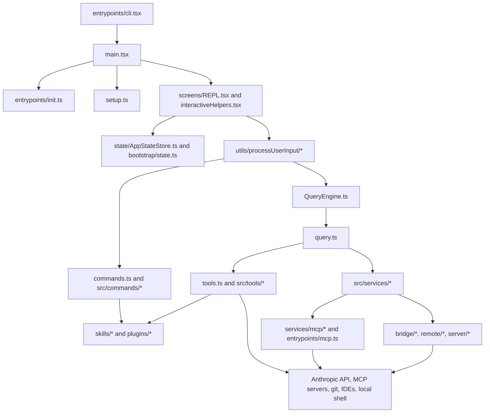
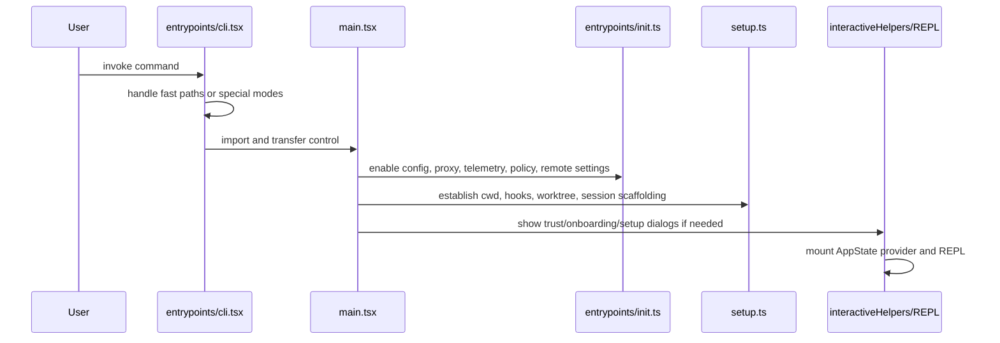

# Architecture

## Overview
Tags: layers, runtime-shape, execution-surfaces

The recovered Claude Code snapshot is organized as a layered terminal application with multiple execution surfaces sharing the same tool and message abstractions:

- a thin CLI bootstrap for fast-path commands and mode selection
- a heavy main startup coordinator that prepares config, policy, auth, telemetry, MCP, plugins, and rendering
- an interactive REPL surface built with React and a custom Ink wrapper
- a reusable conversation engine plus query loop for model interaction and tool execution
- extension layers for commands, tools, skills, plugins, tasks, and remote collaboration

## Layer Diagram
Tags: mermaid, subsystem-map

## Architectural Characteristics
Tags: design-patterns, implementation-style

### 1. Fast-path boot followed by deferred expansion

`src/entrypoints/cli.tsx` intentionally keeps startup light. It short-circuits simple or special invocation modes such as:

- version output
- bridge and daemon paths
- background session management
- dedicated MCP or native-host modes

Everything else graduates into `src/main.tsx`, which performs the expensive initialization.

### 2. Shared execution core across surfaces

The same internal tool model is reused by:

- the interactive REPL
- the query engine used for headless or SDK-like flows
- the MCP server in `src/entrypoints/mcp.ts`

That reuse is visible in the way `Tool`, `ToolUseContext`, `getTools()`, and `QueryEngine` are referenced across entrypoints.

### 3. Message-centric conversation state

The application is message-driven. User input, assistant output, system notices, progress events, tool results, and remote events are all normalized into a shared message stream. The missing `src/types/message.js` file limits exact schema reconstruction, but the surrounding code clearly treats messages as the canonical session record.

### 4. Single shared UI state with task overlays

`AppStateStore` carries session-wide mutable UI state: model choices, permissions, MCP clients, loaded plugins, task registry, file history, attribution, and remote connection metadata. Background work is modeled explicitly as task state rather than ad hoc promises.

### 5. Bun feature-flag driven dead-code elimination

The codebase makes pervasive use of `feature('FLAG')` checks plus lazy `require()` calls. This is not cosmetic. It changes the reachable architecture for different builds, especially around:

- assistant and proactive modes
- coordinator and swarm behavior
- bridge and daemon features
- voice, browser, and remote triggers
- experimental compacting, plan verification, and background session flows

### 6. Markdown-based extensibility

Skills and many plugin commands are loaded from markdown and frontmatter rather than hard-coded TypeScript registries. This is one of the strongest repo-specific deviations from a typical TypeScript CLI layout.

## Startup Architecture
Tags: startup, trust, initialization

The trust boundary is explicit. `interactiveHelpers.tsx` delays some behavior until trust is accepted, including:

- applying the full managed environment
- initializing telemetry after trust
- approving `mcp.json` servers and external `CLAUDE.md` includes

## Runtime Architecture
Tags: repl, query, orchestration

The interactive runtime centers on `src/screens/REPL.tsx`, which orchestrates:

- user input capture
- queue handling
- prompt categorization
- permission dialogs
- remote session hooks
- message rendering
- background task navigation
- session restore and file-history integration

Once a prompt should actually query the model, control moves through:

- `utils/processUserInput/processUserInput.ts`
- `QueryEngine.ts`
- `query.ts`
- `services/tools/toolOrchestration.ts`
- service-specific integrations such as API, MCP, compaction, logging, and session storage

## Extension Architecture
Tags: commands, tools, plugins, skills

The extension story has four separate but connected layers:

- builtin command registry in `src/commands.ts`
- builtin tool registry in `src/tools.ts`
- skill loading from markdown and frontmatter in `src/skills/loadSkillsDir.ts`
- plugin command loading from plugin markdown in `src/utils/plugins/loadPluginCommands.ts`

This separation matters because not every user-facing capability is represented as TypeScript command code. Some behavior is data-driven by markdown, frontmatter, hooks, or plugin manifests.

## Remote And Integration Architecture
Tags: remote, bridge, mcp, collaboration

Three distinct integration families appear in the snapshot:

- Anthropic API access through `src/services/api/*`
- MCP client and server behavior through `src/services/mcp/*` and `src/entrypoints/mcp.ts`
- remote and bridge collaboration surfaces through `src/bridge/*`, `src/remote/*`, and `src/server/*`

These are sibling architectures rather than minor add-ons. The bridge and remote subsystems have their own session transport logic, error handling, permission exchange, and reconnect semantics.

## Architectural Risks And Caveats
Tags: caveats, extracted-source

- The recovered tree is detailed enough to reconstruct subsystem boundaries, but not authoritative enough to guarantee every generated type file is present.
- The missing message type source weakens exact reconstruction of the most central data contract.
- Feature-flagged code can make subsystems look present even when they may be absent from a given distributed build.
- The lack of package manifests means architecture can be described confidently, but dependency versions and official build expectations cannot.
