# Codebase Info

## Scope
Tags: provenance, repository-shape, extraction

This repository is an unofficial research archive of the published npm package `@anthropic-ai/claude-code` version `2.1.88`. It is not an upstream development checkout. The analysis target for this run is the current workspace root (`.`), and the documentation output is refreshed in `.agents/summary/` with a consolidated root `AGENTS.md`.

Top-level repository contents:

- `src/`: recovered TypeScript and TSX source tree used for behavioral analysis
- `artifacts/original/`: original published tarball retained for provenance
- `artifacts/extracted/`: zip of the recovered source tree
- `scripts/extract-sources.js`: local helper used to rehydrate sources from `cli.js.map`
- `.agents/summary/`: generated codebase summary documents and reserved support directories
- `AGENTS.md`: concise root-level navigation file for coding agents

## Basic Facts
Tags: languages, inputs, summary-parameters

| Item | Observation |
|---|---|
| Analyzed path | `.` |
| Output directory | `.agents/summary` |
| Consolidated output | `AGENTS.md` |
| Primary code tree | `src/` |
| Dominant implementation language | TypeScript |
| UI language | TSX / React |
| Helper scripting | JavaScript |
| Documentation language | Markdown |
| Package and lockfile metadata | Not present in the recovered snapshot |
| CI configuration | Not present in the recovered snapshot |

## Repository Map
Tags: structure, mermaid, navigation

```mermaid
graph TD
    Root[Repository Root]
    Root --> Docs[README.md and AGENTS.md]
    Root --> Summary[.agents/summary/]
    Root --> Artifacts[artifacts/]
    Root --> Scripts[scripts/]
    Root --> Src[src/]

    Summary --> Index[index.md]
    Summary --> Topics[topic docs]
    Summary --> SupportDirs[diagrams, inventories, metadata]

    Artifacts --> Original[original package tarball]
    Artifacts --> Extracted[extracted source zip]

    Scripts --> Extractor[extract-sources.js]

    Src --> Entrypoints[entrypoints/]
    Src --> MainFiles[top-level orchestrators]
    Src --> Screens[screens/]
    Src --> Components[components/]
    Src --> Hooks[hooks/]
    Src --> Commands[commands/]
    Src --> Tools[tools/]
    Src --> Services[services/]
    Src --> State[state/]
    Src --> Tasks[tasks/]
    Src --> Bridge[bridge/]
    Src --> Remote[remote/]
    Src --> Server[server/]
    Src --> Skills[skills/]
    Src --> Plugins[plugins/]
    Src --> Utils[utils/]
    Src --> Context[context/]
    Src --> Constants[constants/]
```

## Languages And Support Boundaries
Tags: supported-languages, limitations

### Present In The Snapshot

- TypeScript (`.ts`) is the dominant implementation language.
- TSX (`.tsx`) is used for the React and Ink-based terminal UI.
- JavaScript (`.js`) appears mainly in helper scripts and a small number of recovered runtime files.
- Markdown (`.md`) is used for repository documentation plus skill and plugin content.

### Runtime-Facing Language Support

The product code is TypeScript-first, but it clearly orchestrates multiple execution environments:

- shell execution via Bash-oriented tooling
- PowerShell execution via a dedicated PowerShell tool
- notebook mutation through `NotebookEditTool`
- MCP transports over stdio, SSE, HTTP, WebSocket, SDK, and internal IDE-oriented variants

### Not Represented In The Snapshot

- No Python, Go, Rust, Java, or C/C++ source trees were recovered.
- No native-source directories or package manifests were recovered.
- Logic implemented in native binaries, bundled vendor assets, or unpublished internal repositories is outside the reach of this analysis.

## Inferred Technology Stack
Tags: stack, dependencies, runtime

The recovered tree strongly suggests the following stack:

- Bun build-time feature gating via `bun:bundle`
- Node.js runtime primitives such as `fs`, `path`, `os`, `crypto`, `child_process`, HTTP, and streams
- React plus a customized Ink renderer for terminal UI
- Anthropic SDK for model interaction and streamed message exchange
- Model Context Protocol SDK for MCP client and server support
- Zod for schema validation and SDK schema generation
- Axios and `undici` for network access
- OpenTelemetry plus internal analytics, GrowthBook, and Datadog hooks for telemetry and feature rollout
- `lodash-es`, `chalk`, `figures`, `diff`, `marked`, `lru-cache`, `ignore`, `chokidar`, and related utility packages

Because there is no `package.json` or lockfile in the snapshot, versions are inferred only from imports and comments, not from authoritative manifest metadata.

## Key Entrypoints
Tags: entrypoints, execution-surfaces

| File or area | Role |
|---|---|
| `src/entrypoints/cli.tsx` | Minimal CLI bootstrap with fast-path dispatch for version, bridge, daemon, background sessions, and special transport modes |
| `src/main.tsx` | Main startup coordinator that wires config, commands, tools, policy, auth, MCP, plugins, skills, state, and rendering |
| `src/entrypoints/init.ts` | Early init path for config enabling, managed environment, proxy, telemetry, policy limits, remote managed settings, and LSP cleanup registration |
| `src/setup.ts` | Session setup, cwd handling, worktree and tmux preparation, hook snapshotting, and terminal recovery |
| `src/screens/REPL.tsx` | Primary interactive UI and long-lived conversation surface |
| `src/QueryEngine.ts` | Reusable conversation engine for turn submission and stateful session handling |
| `src/query.ts` | Core query loop, tool orchestration, compaction, retries, and stop-hook handling |
| `src/entrypoints/mcp.ts` | Stdio MCP server that re-exposes Claude Code tools to external MCP clients |

## Documentation Layout
Tags: generated-docs, output-structure

Primary generated files:

- `index.md`: first file to load for AI-assistant retrieval
- `codebase_info.md`: repository scope, layout, and caveats
- `architecture.md`, `components.md`, `interfaces.md`, `data_models.md`, `workflows.md`, `dependencies.md`: focused deep dives
- `review_notes.md`: consistency and completeness findings

Supporting directories ensured for this run:

- `diagrams/`: reserved for future standalone Mermaid or exported diagram artifacts
- `inventories/`: reserved for machine-generated inventories and indexes
- `metadata/`: reserved for structured metadata outputs

## Analysis Caveats
Tags: caveats, extraction-artifacts, confidence

- The repository is a recovered source snapshot, not a normal authoring repository.
- Some files, such as `src/state/AppState.tsx`, appear to be transformed output with React compiler artifacts rather than clean hand-authored source.
- The snapshot does not include the package manifest, CI config, or build scripts needed to describe the official release pipeline.
- A notable extraction gap exists around `src/types/message.js`: many files import it, but the corresponding recovered source file is not present under `src/types/`.
- Feature-gated code paths depend heavily on Bun build flags and runtime environment variables, so static reachability does not equal shipped reachability.
