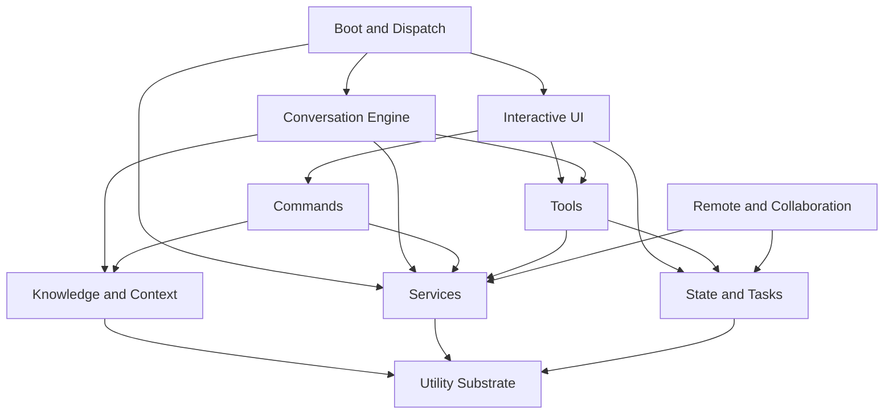

# Components

## Major Subsystems
Tags: ownership, navigation, responsibilities

| Subsystem | Primary locations | Responsibility | Notes |
|---|---|---|---|
| Boot and dispatch | `src/entrypoints/cli.tsx`, `src/main.tsx`, `src/setup.ts`, `src/entrypoints/init.ts` | startup, config, auth, policy, session setup, mode dispatch | `cli.tsx` is intentionally light; `main.tsx` is the heavy coordinator |
| Interactive UI | `src/screens/REPL.tsx`, `src/components/*`, `src/hooks/*`, `src/ink.ts`, `src/ink/*` | terminal rendering, prompt UX, dialogs, keybindings, task panels, message display | built on React plus a custom Ink layer |
| Conversation engine | `src/QueryEngine.ts`, `src/query.ts`, `src/query/*`, `src/utils/processUserInput/*` | prompt normalization, message assembly, API query loop, retries, compaction, tool execution | shared logic across interactive and headless use |
| Commands | `src/commands.ts`, `src/commands/*` | slash-command registry and local command behavior | includes prompt commands, local-jsx commands, and extension-derived commands |
| Tools | `src/tools.ts`, `src/tools/*`, `src/Tool.ts` | model-callable tool definitions and execution | includes file, shell, agent, MCP, LSP, web, planning, and task tools |
| Services | `src/services/*` | integrations and cross-cutting infrastructure | API, analytics, MCP, LSP, policy, settings sync, memory, compaction |
| State and tasks | `src/state/*`, `src/tasks/*`, `src/Task.ts` | persistent UI state, background task lifecycle, foreground/background transitions | central to swarms, background sessions, and remote views |
| Collaboration and remote | `src/bridge/*`, `src/remote/*`, `src/server/*`, `src/coordinator/*`, `src/buddy/*` | remote control, bridge sessions, direct-connect, teammate/coordinator behavior | heavily feature-gated |
| Knowledge and context | `src/context.ts`, `src/context/*`, `src/memdir/*`, `src/skills/*`, `src/plugins/*` | session context, CLAUDE.md injection, skill loading, plugin wiring | markdown-driven extensibility is a defining trait |
| Utility substrate | `src/utils/*`, `src/constants/*`, `src/bootstrap/*`, `src/types/*` | shared helpers, config, permissions, telemetry, IDs, parsing, storage | largest and most cross-cutting area |

## Component Map
Tags: mermaid, subsystem-map

## Directory-Oriented Navigation
Tags: directories, finding-code

### When the task is about terminal UX

Start with:

- `src/screens/REPL.tsx`
- `src/components/`
- `src/hooks/`
- `src/keybindings/`
- `src/ink/`

### When the task is about slash commands or user-invoked actions

Start with:

- `src/commands.ts`
- `src/commands/<command-name>/`
- `src/utils/processUserInput/processSlashCommand.tsx`

### When the task is about model tool usage

Start with:

- `src/tools.ts`
- `src/Tool.ts`
- `src/services/tools/`
- the relevant `src/tools/<ToolName>/` directory

### When the task is about API calls, MCP, or policy

Start with:

- `src/services/api/`
- `src/services/mcp/`
- `src/services/policyLimits/`
- `src/services/remoteManagedSettings/`

### When the task is about collaboration or remote execution

Start with:

- `src/bridge/`
- `src/remote/`
- `src/server/`
- `src/tasks/`
- `src/coordinator/`

### When the task is about memory, prompts, or injected context

Start with:

- `src/context.ts`
- `src/memdir/`
- `src/utils/claudemd.js`
- `src/utils/queryContext.ts`
- `src/constants/prompts.js`

## Notable Component Clusters
Tags: hotspots, subsystem-details

### `src/commands/`

This is a large registry surface. It contains both conventional user-facing commands and internal operational commands such as review, permissions, plugins, session management, remote setup, and background tooling.

### `src/tools/`

This is the core model-tool surface. The builtin registry includes:

- file read, edit, and write tools
- shell and PowerShell execution
- grep and glob search
- MCP resource inspection
- LSP access
- web fetch and web search
- task creation/list/update
- planning, skill, worktree, and agent-related tools

### `src/services/`

The most architecturally important service families are:

- `api/`: model request assembly, retry, logging, output formatting
- `mcp/`: server config, connection, auth, tool/resource proxying
- `analytics/`: telemetry, feature flags, first-party logging
- `compact/`: auto-compact, reactive compact, microcompact, snip behaviors
- `lsp/`: language-server lifecycle management

### `src/utils/`

The utility layer is not just generic helper code. It contains major domain logic for:

- permissions
- settings and managed env
- system prompt construction
- session storage and restore
- git and repository context
- IDE integration
- worktrees
- hooks
- plugin loading
- telemetry and tracing

## Component-Level Caveats
Tags: caveats, extracted-source

- `src/plugins/bundled/index.ts` is currently scaffolding, which suggests plugin capability exists but bundled plugins are either minimal or stripped from this snapshot.
- `src/state/AppState.tsx` appears transformed rather than pristine source, so code style there should not be treated as a hand-authored baseline.
- The missing message type source means message-rendering components can be located reliably, but the canonical message union cannot be quoted from source with full confidence.
