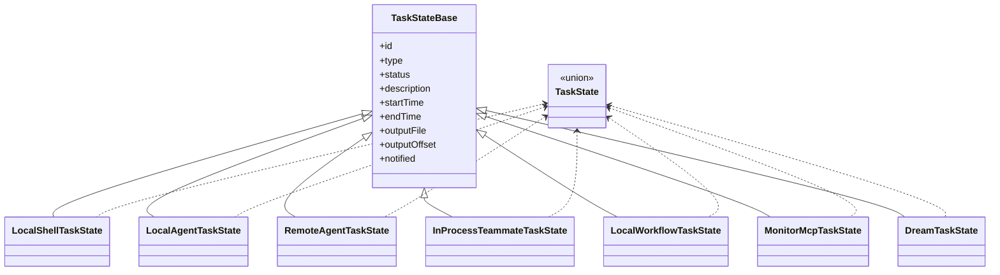

# Data Models

## Model Overview
Tags: state, schemas, unions

The most important recoverable data models in this snapshot are:

- `AppState` for session-wide runtime state
- `TaskState` and task-type unions for background execution
- `ToolPermissionContext` and `ToolUseContext` for tool execution
- `QueryEngineConfig` for conversation orchestration
- `McpServerConfig` and connection-status unions for MCP
- SDK serializable schemas in `entrypoints/sdk/coreSchemas.ts`

## State Model
Tags: appstate, runtime-state

```mermaid
graph TD
    AppState[AppState]
    AppState --> Settings[settings and model choices]
    AppState --> Permissions[toolPermissionContext]
    AppState --> MCP[mcp clients, tools, commands, resources]
    AppState --> Plugins[enabled and disabled plugins]
    AppState --> Tasks[tasks registry and task focus]
    AppState --> Agents[agent definitions and name registry]
    AppState --> History[fileHistory and attribution]
    AppState --> Remote[remote and bridge connection state]
    AppState --> Todos[todo lists and prompt suggestion state]
    AppState --> Notifications[notifications and elicitation queue]
    AppState --> Panels[tool-specific panel state]
```

`AppStateStore.ts` shows that `AppState` is the central mutable state for the UI session. Key model families inside it include:

- settings and model selection
- permission context and mode
- bridge and remote session status
- task registry and selected task views
- loaded MCP clients, tools, commands, and resources
- plugin enablement, errors, and refresh state
- agent definitions, name registry, and teammate-related view state
- file history and attribution state
- notification and elicitation queues
- tool-specific UI state such as Tungsten and WebBrowser panel visibility

`AppStateStore.ts` also defines session-level speculative execution and completion-boundary models such as:

- `CompletionBoundary`
- `SpeculationResult`
- `SpeculationState`

Those types matter for prompt suggestion, speculative rendering, and turn-completion heuristics even though they are not the first things most feature work touches.

## Task Model
Tags: tasks, background-work

`src/Task.ts` defines:

- `TaskType`: `local_bash`, `local_agent`, `remote_agent`, `in_process_teammate`, `local_workflow`, `monitor_mcp`, `dream`
- `TaskStatus`: `pending`, `running`, `completed`, `failed`, `killed`
- `TaskStateBase`: shared fields such as ID, description, timestamps, output file, and notification state

`src/tasks/types.ts` then builds `TaskState` as a union of concrete task-state types for each task family.

## Tool Execution Models
Tags: tools, permissions, execution-context

`src/Tool.ts` exposes several core models:

- `ValidationResult`
- `ToolPermissionContext`
- `ToolUseContext`
- tool progress event unions
- system prompt, attribution, and file-history attachments to execution context

`ToolPermissionContext` is especially important because it carries:

- permission mode
- additional working directories
- allow, deny, and ask rules by source
- bypass and auto-mode availability
- prompt-avoidance and dialog-awaiting behavior

`ToolUseContext` then composes the runtime dependencies a tool needs:

- commands and tools
- current model and thinking config
- MCP clients and resources
- app-state accessors
- file-state cache
- notification and UI hooks
- optional elicitation and task-state hooks

## Query And Prompt Models
Tags: query-engine, orchestration

`src/QueryEngine.ts` defines `QueryEngineConfig`, which bundles:

- working directory
- commands, tools, and agents
- MCP clients
- app-state access
- message history
- file cache
- system prompt overrides
- model and thinking choices
- budget and turn limits
- SDK status and elicitation hooks

`src/query.ts` then defines `QueryParams`, a more execution-focused turn model containing:

- messages
- system, user, and system-context prompt data
- tool permission context
- model fallback and budget controls
- query source

## MCP Models
Tags: mcp, config, transport

`src/services/mcp/types.ts` is one of the cleanest schema definitions in the repo.

Important model families:

- `ConfigScope`: `local`, `user`, `project`, `dynamic`, `enterprise`, `claudeai`, `managed`
- `Transport`: `stdio`, `sse`, `sse-ide`, `http`, `ws`, `sdk`
- server config unions for each transport style
- internal IDE-specific WebSocket config plus `claudeai-proxy` config
- scoped config with source metadata
- connection-state unions such as connected, failed, needs-auth, pending, and disabled

These models are used both to drive runtime behavior and to explain why a given MCP integration is unavailable.

## SDK Schemas
Tags: sdk, serialization

`src/entrypoints/sdk/coreSchemas.ts` exposes serializable schemas for:

- model usage accounting
- JSON-schema output mode
- API key source and config scope
- thinking configuration
- permission rule destinations and behaviors
- MCP server status

This file is the most authoritative model source for SDK-facing serialization in the snapshot.

## Message Model Status
Tags: messages, inferred-model, limitation

The codebase clearly depends on a shared `Message` union and related types such as:

- `UserMessage`
- `AssistantMessage`
- `SystemMessage`
- `AttachmentMessage`
- `ProgressMessage`
- API error and compact-boundary variants

However, the canonical recovered source file for `src/types/message.js` is missing from the extracted tree. As a result:

- the existence of these model families is high-confidence
- the exact field-level schema is medium-confidence and inferred from imports and helper usage
- any refactor that depends on exact message typing should confirm against the original package artifacts or runtime behavior

## Data Model Caveats
Tags: caveats, completeness

- `AppState` is recoverable because `AppStateStore.ts` is present, but some downstream message and log types point to missing source.
- Some source files appear transformed rather than pristine authored TypeScript, so type presentation may not match original repository ergonomics.
- Generated or binary-backed models outside the recovered TypeScript tree are not reconstructable from this snapshot alone.
