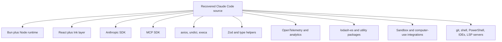

# Dependencies

## Dependency Posture
Tags: inferred-dependencies, manifests-missing

This repository does not include a package manifest, lockfile, or CI config. Dependency analysis is therefore inferred from imports, comments, and runtime usage patterns in the recovered source tree.

Treat package presence as high-confidence and exact versioning as low-confidence.

## Dependency Categories
Tags: packages, runtime, tooling

| Category | Inferred dependencies | Why they matter |
|---|---|---|
| Build/runtime platform | `bun:bundle`, Node.js core modules | build-time feature gating, filesystem, process control, crypto, networking |
| Model API | `@anthropic-ai/sdk` | model calls, streaming content, tool blocks, usage reporting |
| MCP | `@modelcontextprotocol/sdk` | client/server transports, tool schemas, resources, elicitation, stdio server exposure |
| UI | `react`, `react/compiler-runtime`, custom Ink implementation, `chalk`, `figures`, `usehooks-ts` | terminal UI, rendering, colors, input and effect hooks |
| Validation and schemas | `zod/v4`, `type-fest` | runtime validation, serializable SDK and MCP schemas, shared utility typing |
| Networking and process | `axios`, `undici`, `execa`, `shell-quote` | HTTP access, transport support, subprocess management, shell parsing |
| Telemetry | `@opentelemetry/api`, `@opentelemetry/sdk-logs`, internal analytics, GrowthBook, Datadog hooks | tracing, feature rollout, event logging |
| File watching and parsing | `chokidar`, `ignore`, `marked`, `diff`, `strip-ansi`, `@alcalzone/ansi-tokenize` | hook watching, gitignore handling, markdown parsing, text rendering, ANSI-aware formatting |
| Utilities and caching | `lodash-es`, `lru-cache`, `semver`, `qrcode` | collection helpers, caches, version checks, QR output in auth and setup flows |
| Optional or internal integrations | `@ant/computer-use-mcp`, `@anthropic-ai/sandbox-runtime` | feature-gated integrations for computer-use and sandboxed execution |

## Dependency Graph
Tags: mermaid, stack

## Inferred Third-Party Packages
Tags: third-party, inventory

High-signal packages observed directly in imports include:

- `@anthropic-ai/sdk`
- `@modelcontextprotocol/sdk`
- `@commander-js/extra-typings`
- `react`
- `react/compiler-runtime`
- `zod/v4`
- `axios`
- `undici`
- `execa`
- `shell-quote`
- `chalk`
- `figures`
- `lodash-es`
- `usehooks-ts`
- `strip-ansi`
- `diff`
- `marked`
- `semver`
- `lru-cache`
- `ignore`
- `chokidar`
- `qrcode`
- `@opentelemetry/api`
- `@opentelemetry/sdk-logs`
- `@alcalzone/ansi-tokenize`
- `@ant/computer-use-mcp`
- `@anthropic-ai/sandbox-runtime`

## Platform And Executable Dependencies
Tags: external-tools, os-integration

The code also depends on external executables or platform features, including:

- `git`
- `gh` for review and GitHub-oriented flows
- shell execution for Bash-oriented tool behavior
- PowerShell for Windows shell behavior
- OS-specific utilities such as `plutil` or Windows registry queries during startup and settings handling
- editor and IDE integrations
- local or plugin-provided LSP servers

These dependencies are often more operationally important than npm packages because they affect runtime capability and permissions.

## Config-Driven Dependency Behavior
Tags: config, feature-flags

Several dependency families are conditioned by config or feature flags:

- bridge and daemon code paths
- assistant and proactive features
- web browser or remote trigger capabilities
- background session support
- voice and browser-native-host integrations
- compacting and verification features
- computer-use, sandbox, and remote-trigger capabilities

This means dependency relevance is context-dependent. Presence in source does not guarantee activation in a given session.

## Dependency Caveats
Tags: caveats, missing-manifest

- Version resolution is incomplete without a manifest.
- Some dependencies may be bundled or internal to the published package rather than represented as standalone manifest entries here.
- Native or binary dependencies inside the original tarball are outside this documentation set unless referenced from TypeScript call sites.
