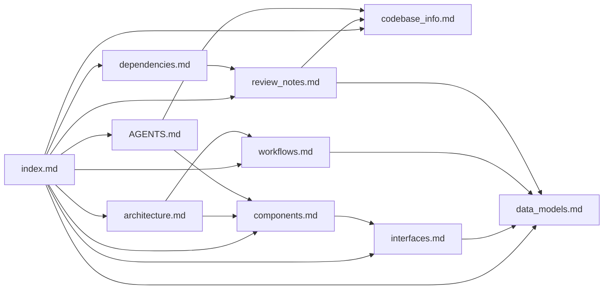

# Codebase Summary Index

## Purpose
Tags: ai-assistants, routing, primary-context

This file is the primary context entry point for AI assistants working in this repository. Load `index.md` first, then pull in one or two focused documents based on the task instead of reading the full summary set at once.

This repository is a recovered source snapshot of the published `@anthropic-ai/claude-code` package, not a normal authoring checkout. Retrieval strategy matters because some files are transformed, some authoring metadata is absent, and at least one central type source is imported widely but missing from the recovered tree.

## How To Use This Knowledge Base
Tags: usage, retrieval, agent-guidance

1. Read `codebase_info.md` if you need provenance, repository layout, language boundaries, or confidence limits.
2. Read `architecture.md` to understand the runtime layers and why `cli.tsx`, `main.tsx`, `init.ts`, `setup.ts`, `REPL.tsx`, `QueryEngine.ts`, and `query.ts` are split.
3. Read `components.md` when you need the owner directory for a feature or want the fastest file-routing map.
4. Read `interfaces.md` when the task touches command/tool contracts, MCP transports, SDK schemas, plugins, or remote-control boundaries.
5. Read `data_models.md` when the task depends on `AppState`, task unions, permission context, MCP config unions, or serializable SDK schemas.
6. Read `workflows.md` when you need end-to-end execution flow such as startup, prompt intake, query/tool loops, MCP exchange, or remote session handling.
7. Read `dependencies.md` when you need inferred third-party packages, platform dependencies, or operational executables.
8. Read `review_notes.md` before making strong assumptions about missing types, buildability, or completeness.
9. Read the root `AGENTS.md` when you want the shortest consolidated navigation guide rather than the full generated set.

## Summary Layout
Tags: output-dir, generated-files, artifacts

The documentation set under `.agents/summary/` contains the main markdown knowledge base plus a few reserved support directories:

- `index.md`: routing and retrieval guide
- `codebase_info.md`: provenance, repository shape, language boundaries, caveats
- `architecture.md`: runtime layers and design principles
- `components.md`: subsystem ownership and directory-level navigation
- `interfaces.md`: contracts, transports, and extension boundaries
- `data_models.md`: state and schema model reference
- `workflows.md`: end-to-end execution flows
- `dependencies.md`: inferred dependency stack and operational dependencies
- `review_notes.md`: consistency and completeness findings
- `diagrams/`, `inventories/`, `metadata/`: reserved supporting artifact directories for future standalone outputs

The consolidated root-level output for this run is `AGENTS.md`.

## Document Catalog
Tags: toc, metadata, summaries

| File | Primary purpose | Consult this when | Key contents | Related docs |
|---|---|---|---|---|
| `codebase_info.md` | Baseline repository metadata | You need scope, provenance, languages, layout, or output structure | repository map, documentation layout, language boundaries, key entrypoints, caveats | `review_notes.md`, `architecture.md` |
| `architecture.md` | System shape and design principles | You need the high-level runtime decomposition | layer diagram, startup architecture, execution surfaces, design patterns | `components.md`, `workflows.md` |
| `components.md` | Major subsystems and directory ownership | You need to find the most likely implementation area for a change | subsystem map, responsibility table, directory-oriented navigation | `architecture.md`, `interfaces.md` |
| `interfaces.md` | Contracts and integration surfaces | You need API boundaries or extension points | CLI and slash-command surfaces, tool contracts, MCP config unions, SDK schemas, remote interfaces | `data_models.md`, `workflows.md` |
| `data_models.md` | State and schema model reference | You need important types, unions, or stored state | `AppState`, `TaskState`, permission context, MCP status/config unions, SDK schemas, inferred message model | `interfaces.md`, `review_notes.md` |
| `workflows.md` | End-to-end execution narratives | You need to trace control flow through the runtime | startup, prompt handling, tool loop, MCP exchange, bridge/remote workflows | `architecture.md`, `components.md` |
| `dependencies.md` | Inferred dependency inventory | You need package, runtime, or executable dependencies | package categories, platform dependencies, observability stack, optional/internal integrations | `codebase_info.md`, `review_notes.md` |
| `review_notes.md` | Consistency and completeness review | You need confidence limits or documentation gaps | extraction gaps, unsupported-source boundaries, recommendations | `codebase_info.md`, `data_models.md` |
| `../AGENTS.md` | Concise consolidated repo guide | You need the shortest high-signal navigation file | start-here files, subsystem map, task routing, repo-specific patterns | `index.md`, `components.md` |

## Relationship Map
Tags: relationships, mermaid, navigation

## Retrieval Playbook
Tags: query-routing, question-types

### Use `architecture.md` for:

- “Where does startup happen?”
- “Why are there both `main.tsx` and `entrypoints/cli.tsx`?”
- “How do REPL, QueryEngine, tools, and MCP relate?”

### Use `components.md` for:

- “Where should I look for tool logic?”
- “Which directories own remote-control or bridge behavior?”
- “What part of the repo handles plugins, skills, tasks, or hooks?”

### Use `interfaces.md` for:

- “What does a tool need to implement?”
- “How are MCP servers configured and connected?”
- “Which boundary handles direct-connect or remote sessions?”

### Use `data_models.md` for:

- “What is stored in `AppState`?”
- “How are tasks modeled?”
- “What schemas exist for SDK or MCP state?”

### Use `workflows.md` for:

- “What happens when a user submits a prompt?”
- “How do slash commands fork work into agents?”
- “How does bridge or remote execution stay connected?”

### Use `review_notes.md` for:

- “Why does a referenced type file appear to be missing?”
- “What parts of the original system are not reconstructable here?”
- “What assumptions are risky because this is an extracted tree?”

## Suggested Assistant Context Strategy
Tags: context-management, efficiency

- Minimum context for general navigation: `index.md`
- Minimum context for code changes: `index.md` plus one of `components.md`, `interfaces.md`, or `workflows.md`
- Minimum context for debugging missing-file or type issues: `index.md` plus `review_notes.md` and `codebase_info.md`
- Minimum context for remote or MCP work: `index.md` plus `interfaces.md` and `workflows.md`
- Minimum context for fast repo orientation: `AGENTS.md`, then `index.md` only if deeper detail is needed

## Example Queries
Tags: examples, ai-assistants

- “Show me where prompt submission becomes API calls and tool execution.”
- “Which files are the best starting point for MCP server bugs?”
- “How is runtime state split between `AppState`, task state, and session storage?”
- “What extraction gaps should I keep in mind before refactoring message types?”
