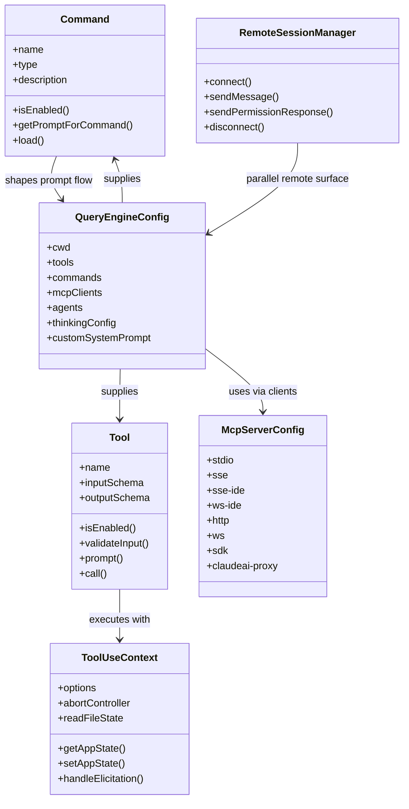

# Interfaces

## Interface Overview
Tags: contracts, boundaries, integration-points

This codebase exposes several distinct interface families:

- user-facing CLI and slash-command interfaces
- prompt-intake and queueing interfaces
- model-callable tool interfaces
- MCP client and server interfaces
- SDK and remote-control schemas
- plugin and skill extension interfaces
- OS and repository interfaces such as git, shell, filesystem, and IDE/LSP connections

## Contract Diagram
Tags: mermaid, contracts

## CLI And Slash Commands
Tags: cli, commands

The CLI interface has two layers:

- process-level argument dispatch in `src/entrypoints/cli.tsx`
- in-session slash commands registered through `src/commands.ts`

Important characteristics:

- special modes are fast-pathed before the full CLI is loaded
- slash commands can be prompt-based, local-jsx, or dynamically loaded
- some slash commands can fork work into background or sub-agent flows
- skill- and plugin-derived commands are added alongside builtin commands

The best files for CLI and command semantics are:

- `src/entrypoints/cli.tsx`
- `src/commands.ts`
- `src/utils/processUserInput/processSlashCommand.tsx`

## Prompt Intake Interface
Tags: input-processing, hooks, queueing

`src/utils/processUserInput/processUserInput.ts` is the clearest contract for turning terminal input into model-facing work. Its return shape determines whether an input:

- produces normalized `Message` objects
- short-circuits the model query
- constrains the tool set for the turn
- overrides model or effort
- injects follow-up queued input

This file is also where user-prompt hooks, slash-command parsing, attachment handling, and hidden meta-prompt behavior intersect.

## Tool Interface
Tags: tools, model-contract

`src/Tool.ts` defines the central tool contract. The important pieces are:

- schema-driven input and optional output definitions
- enablement and validation hooks
- a `call()` method that executes with `ToolUseContext`
- a shared permission context and app-state bridge
- support for progress messages, notifications, and tool-specific UI

`src/tools.ts` is the builtin registry. It shows that the same abstract tool system is used for:

- local filesystem and shell actions
- web and MCP access
- planning and task manipulation
- skill discovery
- agent and team coordination

## MCP Interfaces
Tags: mcp, client, server

The codebase has both MCP client and MCP server surfaces.

### Client side

`src/services/mcp/types.ts` defines a union of transport configs:

- stdio
- SSE
- SSE-IDE
- WS-IDE
- HTTP
- WebSocket
- SDK
- Claude.ai proxy

It also models connection state such as connected, failed, pending, disabled, and needs-auth.

`src/services/mcp/client.ts` handles:

- client construction
- transport wiring
- auth refresh and step-up logic
- tool and resource exposure
- truncation and persistence of large outputs
- reconnect and session-expiry handling

### Server side

`src/entrypoints/mcp.ts` re-exposes Claude Code tools over stdio using the MCP SDK server. This is effectively an adapter from local builtin tools to standard MCP request handlers.

## SDK And Remote-Control Interfaces
Tags: sdk, remote, bridge

`src/entrypoints/sdk/coreSchemas.ts` is the clearest source of serializable SDK-facing contracts in the snapshot. It defines schemas for:

- model usage
- JSON-schema output mode
- thinking configuration
- permission update behavior and destinations
- MCP server status and serializable config

Remote-control surfaces are split across:

- `src/remote/RemoteSessionManager.ts` for session-backed remote communication
- `src/server/createDirectConnectSession.ts` for direct-connect session creation
- `src/bridge/bridgeMain.ts` for bridge-mode polling, spawning, and environment/session management

These are separate interface surfaces with different transport and lifecycle assumptions.

## State And Task Interfaces
Tags: state, tasks, lifecycle

`src/state/AppStateStore.ts` and `src/Task.ts` define two important internal boundaries:

- application and session UI state
- background task lifecycle and task identity

This split matters when a change affects:

- rendered session state versus durable task state
- foreground versus background execution
- REPL-only flows versus remote or agent-task flows

## Plugin And Skill Interfaces
Tags: plugins, skills, extensions

The extension system is largely file and frontmatter driven.

`src/skills/loadSkillsDir.ts` exposes interfaces around:

- skill path resolution by setting source
- markdown frontmatter parsing
- optional hooks, effort, model, arguments, and execution context

`src/utils/plugins/loadPluginCommands.ts` does similar work for plugin-provided markdown commands and skills.

This means extension interfaces are not only TypeScript types. They are also markdown conventions, directory layout rules, and frontmatter schema rules.

## External System Interfaces
Tags: os, git, ide, shell

The repo clearly interfaces with several external systems:

- git repositories and worktrees
- shell and PowerShell processes
- IDE detection and LSP servers
- browser and native-host flows
- OAuth and keychain-backed credential storage
- policy and managed-settings services

These boundaries are important because many failures in this codebase are integration failures rather than pure in-memory logic failures.

## Interface Caveats
Tags: caveats, confidence

- The canonical message type file is missing from the recovered snapshot, so message-interface details are partly inferred from call sites.
- Package manifests are absent, so external dependency versions cannot be attached to interfaces with certainty.
- Feature flags mean some interfaces exist in source but may not exist in a given shipped build.
