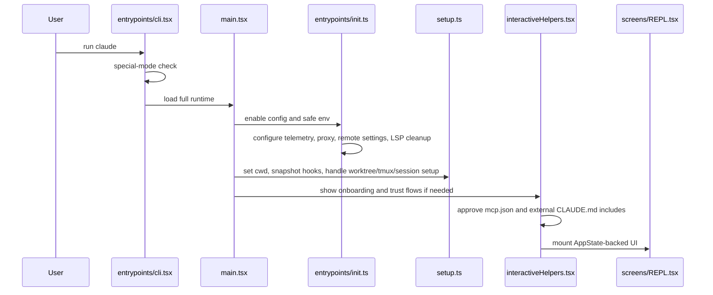
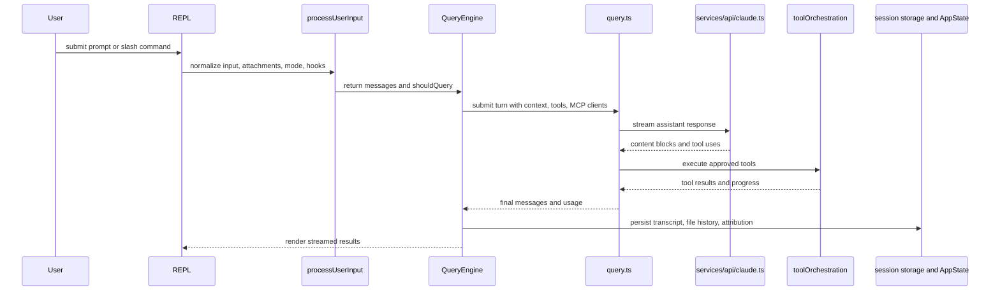
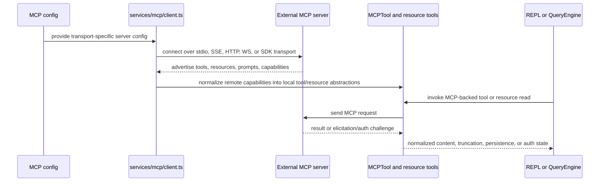

# Workflows

## Workflow Overview
Tags: execution, startup, prompt-loop

The most important end-to-end workflows in this snapshot are:

- interactive startup and trust establishment
- prompt intake and slash-command dispatch
- query and tool execution loop
- MCP connection and exposure
- bridge and remote-session coordination

## Interactive Startup
Tags: startup, onboarding, trust

Key startup observations:

- some environment is applied before trust, but the full managed environment is delayed until trust is accepted
- LSP is initialized asynchronously and can remain unavailable without blocking startup
- git and CLAUDE.md context are prefetched into system and user context models

## Prompt Submission And Query Loop
Tags: prompt-processing, query, tool-execution

Important details from the recovered code:

- prompt submission can be blocked or augmented by hooks
- slash commands may short-circuit the model query
- the query loop handles compaction and retry behavior, including max-output-token recovery
- tool results can feed back into the same turn before the assistant continues

## Slash Command Workflow
Tags: slash-commands, forked-work

`processSlashCommand.tsx` shows three broad command behaviors:

- direct prompt construction for model execution
- local UI or local-action commands
- forked commands that spin up agent work, sometimes in the background

When forked agent execution is used, the workflow can:

- prepare a modified command context
- launch an agent or background task
- wait for MCP to settle if needed
- re-enqueue the result as a hidden follow-up prompt

This is one of the more unusual workflows in the repo because command execution can recursively feed the same queueing and agent infrastructure used by ordinary prompts.

## MCP Workflow
Tags: mcp, client, resources

The MCP server workflow is the inverse:

- `entrypoints/mcp.ts` hosts a stdio server
- builtin Claude Code tools are converted into MCP-exposed tool definitions
- tool calls are executed with a minimal non-interactive `ToolUseContext`

## Remote And Bridge Workflows
Tags: remote, bridge, direct-connect

There are at least three related but distinct remote workflows:

### Remote session manager

`src/remote/RemoteSessionManager.ts` handles:

- WebSocket subscription to remote SDK messages
- HTTP message submission to the remote session
- permission request and response flow
- reconnect and disconnect callbacks

### Direct-connect session creation

`src/server/createDirectConnectSession.ts` handles the initial HTTP POST that creates a remote-capable session and returns session transport details.

### Bridge loop

`src/bridge/bridgeMain.ts` runs a long-lived bridge environment that:

- registers environments and workers
- polls for work
- spawns session processes
- heartbeats active work
- manages reconnect, timeout, and cleanup logic

These workflows are operationally significant and should be treated as first-class subsystems, not minor transport wrappers.

## Supporting Workflows
Tags: secondary-flows

Other notable workflows visible in the snapshot:

- session restore and transcript replay
- background task lifecycle and task notification
- worktree and tmux setup
- CLAUDE.md and memory-file injection
- LSP manager background initialization
- plugin and skill discovery from disk
- auto-compact, microcompact, snip, and post-compact cleanup flows

## Workflow Caveats
Tags: caveats, confidence

- Exact message-shape transitions cannot be documented exhaustively because the canonical message type source is missing from the extracted tree.
- Runtime behavior of remote or bridge workflows may depend on external services not represented in this snapshot.
- Feature gates can disable entire workflows in some builds, even though the source is present here.
